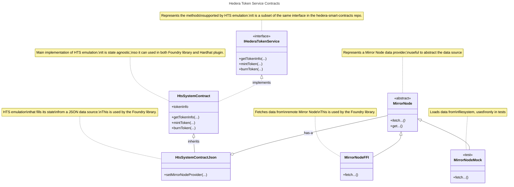
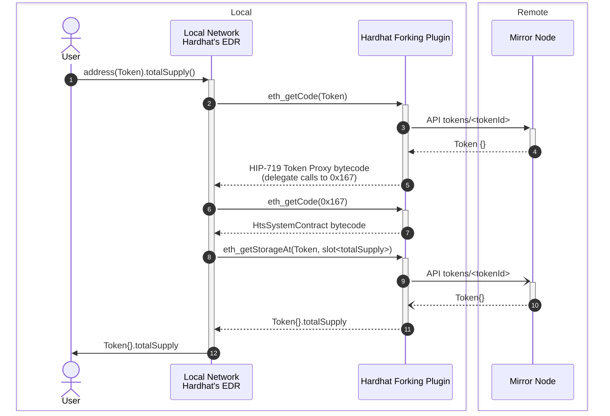

# Internals

This document outlines the design decisions made and how this project is implemented.

## Background

**Fork Testing**/**Fixtures** is an Ethereum Development Environment feature that optimizes test execution for Smart Contracts.
It enables snapshotting of blockchain state, saving developement time by avoiding the recreation of the entire blockchain state for each test.
Instead, tests can revert to a pre-defined snapshot, streamlining the testing process.
Moreover, Fork Testing allows the developer to use a remote state as if was local.
Any modification will only affect the local (forked) network, relieving the user to set up private keys to interact with a remote network.

Most populars Ethereum Development Environments provide this feature, such as
[Foundry](https://book.getfoundry.sh/forge/fork-testing) and
[Hardhat](https://hardhat.org/hardhat-network/docs/overview#mainnet-forking).
This feature is enabled by their underlaying Development network, for example

- Hardhat's [EJS (EthereumJS VM)](https://github.com/nomicfoundation/ethereumjs-vm) and [EDR (Ethereum Development Runtime)](https://github.com/NomicFoundation/edr)
- Foundry's [Anvil](https://github.com/foundry-rs/foundry/tree/master/crates/anvil)
- [Ganache _(deprecated)_](https://github.com/trufflesuite/ganache)

> Please note that WaffleJS, a Smart Contracts testing library, when used it standalone, _i.e._, not inside a Hardhat project,
> [uses Ganache internally](https://github.com/TrueFiEng/Waffle/blob/238c11ccf9bcaf4b83c73eca16d25243c53f2210/waffle-provider/package.json#L47).
>
> On the other hand, Geth support some sort of snapshotting with <https://geth.ethereum.org/docs/interacting-with-geth/rpc/ns-debug#debugsethead>,
> but it is not used for development and testing of Smart Contracts.

Moreover, given that Fork testing runs on a local development network, users can use `console.log` in tests to ease the debugging process.
With `console.log`, you can print logging messages and contract variables calling `console.log` from your Solidity code.
Both [Foundry](https://book.getfoundry.sh/reference/forge-std/console-log) and [Hardhat](https://hardhat.org/tutorial/debugging-with-hardhat-network) support `console.log` (Ganache also supported `console.log`).

### How do Fixtures technically work under the hood?

Fixtures allow developers to define and reuse configurations within their test code.
These configurations detail the necessary setup steps to prepare the test environment, such as creating mock contracts or loading test data.

Fixture is a wrapper around [_Snapshot and Revert state_](https://archive.trufflesuite.com/blog/introducing-ganache-7/#4-snapshot-and-revert-state).
This is achieved by using two JSON-RPC calls,
[`evm_snapshot`](https://github.com/trufflesuite/ganache/blob/ef1858d5d6f27e4baeb75cccd57fb3dc77a45ae8/src/chains/ethereum/ethereum/RPC-METHODS.md#evm_snapshot) and
[`evm_revert`](https://github.com/trufflesuite/ganache/blob/ef1858d5d6f27e4baeb75cccd57fb3dc77a45ae8/src/chains/ethereum/ethereum/RPC-METHODS.md#evm_revert), which are provided by the underlying development network such as EDR (Hardhat), Anvil (Foundry) or Ganache (Truffle).
Developers can use `evm_snapshot` to capture a snapshot of the blockchain state at a specific block number, and `evm_revert` to revert to that snapshot later.

For example, below is [`fixture.ts`](https://github.com/TrueFiEng/Waffle/blob/238c11ccf9bcaf4b83c73eca16d25243c53f2210/waffle-provider/src/fixtures.ts) from the WaffleJS library to implement Fixtures.

```typescript
import {providers, Wallet} from 'ethers';
import {MockProvider} from './MockProvider';

export type Fixture<T> = (wallets: Wallet[], provider: MockProvider) => Promise<T>;
interface Snapshot<T> {
  fixture: Fixture<T>;
  data: T;
  id: string;
  provider: providers.Web3Provider;
  wallets: Wallet[];
}

export const loadFixture = createFixtureLoader();

export function createFixtureLoader(overrideWallets?: Wallet[], overrideProvider?: MockProvider) {
  const snapshots: Snapshot<any>[] = [];

  return async function load<T>(fixture: Fixture<T>): Promise<T> {
    const snapshot = snapshots.find((snapshot) => snapshot.fixture === fixture);
    if (snapshot) {
      await snapshot.provider.send('evm_revert', [snapshot.id]);
      snapshot.id = await snapshot.provider.send('evm_snapshot', []);
      return snapshot.data;
    } else {
      const provider = overrideProvider ?? new MockProvider();
      const wallets = overrideWallets ?? provider.getWallets();

      const data = await fixture(wallets, provider);
      const id = await provider.send('evm_snapshot', []);
      snapshots.push({fixture, data, id, provider, wallets});
      return data;
    }
  };
}
```

In the `createFixtureLoader()`, if a `snapshot` is not found, _i.e._, the fixture is created for the first time, Waffle creates a `snapshot` of the current state of the network.
However, when a `snapshot` is found, Waffle `revert`s the network to the `snapshot.id` snapshot created earlier.

Both [Foundry](https://book.getfoundry.sh/forge/writing-tests#before-test-setups) and [Hardhat](https://hardhat.org/tutorial/testing-contracts#reusing-common-test-setups-with-fixtures) support fixtures out-of-the-box.
Foundry's support is implicit given the state is reset for each test.
Moreover, both [Foundry](https://book.getfoundry.sh/reference/anvil/#special-methods) and [Hardhat](https://hardhat.org/hardhat-network/docs/reference#evm_snapshot) support calling `evm_snapshot` and `evm_revert` directly.

Note that this feature is integrated at the Development Environment level,
not the network level.
The ability to snapshot and revert network state through `evm_snapshot` and `evm_revert` is exclusive to local test networks provided by the development environments.
These endpoints are not found in any official Ethereum network, _e.g._, Infura or Alchemy.
Thus, in terms of _Ethereum equivalence_, it is not necessarily true to say that Hedera lacks this feature compared to Ethereum.

### Can Hedera developers use _out-of-the-box_ Fork Testing?

**Yes**, out-of-the-box Fork Testing works well when the Smart Contracts are standard EVM Smart Contracts that do not involve Hedera-specific services.
This is because fork testing is targeted at the local test network provided by the Ethereum Development Environment.
These networks are replicas of the Ethereum network and do not support any Hedera-specific service.

**No**, out-of-the-box Fork Testing will not work on Hedera for contracts that are specific to Hedera.
For example, when a contract includes a call to the `createFungibleToken` method on the HTS System Contract at `address(0x167)`.
The internal local test network provided by the Development Environment does not have any runnable contract deployed at `address(0x167)`.
This is because the local network tries to fetch the code at `address(0x167)`, for which the JSON-RPC Relay returns `0xfe`

```console
$ cast code --rpc-url https://mainnet.hashio.io/api 0x0000000000000000000000000000000000000167
0xfe
```

Not being able to use Fork Testing implies also not being able to use features such as `console.log` and Fixtures during testing,
which cause frustration among Hedera developers.
It would save a lot of time for Hedera developers to have the ability to use fork testing and fixtures on Hedera-specific services.

> [!IMPORTANT]
> This project is an attempt to fill this gap.
> It does so by providing an emulation layer for HTS written in Solidity.
> Given it is written in Solidity, it can executed in a development network environment, such as Foundry or Hardhat.

## Rationale

In the following, _Development fork_ refers to the Ethereum Development Environment used to simulate EVM state locally, _e.g._, Ganache, Hardhat's EDR or Foundry's Anvil.
_Remote network_ refers to the Hedera network to pull EVM bytecode and state from.
It can be either `mainnet`, `testnet`, `previewnet` or any local network, like local-node or solo.

We need to enable fork testing when any of the Hedera Services, _e.g._, Hedera Token Service, are involved.

For any solution to be successful, it needs to comply with the following requirements

- ~~**Must be compatible with any Ethereum Development Environment, _e.g._, Ganache, Hardhat and foundry.** This means that a solution should not make any assumptions on the kind of network is running on. Moreover, ideally, it should not be implemented as a library or hook for the EDE, _e.g._, a Hardhat plugin. This in turn implies no extra setup or additional services that need to be executed by the user.~~
  _To satisfy this requirement, at least we would have to modify the JSON-RPC Relay. To avoid overloading the Relay with more responsabilities and making it more complex, we decided to create specific solutions for Foundry and Hardhat._
- **Must be non-intrusive.** Meaning developers should use the tools and workflows they are already familiar with when fork testing.

> [!NOTE]
> This section focuses on the _Hedera Token Service_ System Contract through `address` `0x167`.
> Other Hedera Services, _e.g._ _Exchange Rate_ `0x168`, _PRNG_ `0x169` or _Hedera Account Service_ `0x16a`, should be solvable using the same mechanisms described here.

When a Development network forks from a remote one, it uses the JSON-RPC interface to fetch code and state at a given point in time (when a block number is specified).

The solution proposes to **emulate HTS** related calls using Solidity.
We can use this mock implementation [`HtsSystemContractMock.sol`](https://github.com/hashgraph/hedera-smart-contracts/blob/8cc3ef8b59860ad27d043f38aa7254fa802d0acb/test/foundry/mocks/hts-precompile/HtsSystemContractMock.sol) in the `hedera-smart-contracts` as a starting point.

Already created Tokens (existing in the remote network) have a bytecode representation.
This bytecode comes from the contract specified in [HIP-719](https://hips.hedera.com/hip/hip-719).
The actual implementation can be found [here](https://github.com/hashgraph/hedera-services/blob/fbac99e75c27bf9c70ebc78c5de94a9109ab1851/hedera-node/hedera-smart-contract-service-impl/src/main/java/com/hedera/node/app/service/contract/impl/state/DispatchingEvmFrameState.java#L96).
See for example the bytecode for USDC Token on mainnet <https://hashscan.io/mainnet/token/0.0.456858>.

```console
$ cast code --rpc-url https://mainnet.hashio.io/api 0x000000000000000000000000000000000006f89a
0x6080604052348015600f57600080fd5b506000610167905077618dc65e000000000000000000000000000000000006f89a600052366000602037600080366018016008845af43d806000803e8160008114605857816000f35b816000fdfea2646970667358221220d8378feed472ba49a0005514ef7087017f707b45fb9bf56bb81bb93ff19a238b64736f6c634300080b0033
```

In a nutshell, this bytecode does not have any state and redirects all incoming calls to `IHederaTokenService(0x167).redirectForToken(address,bytes)` where `address` is the token address and `bytes` is the function selector from the ERC20 or ERC721 interface + the input bytes for the function called.

### Constraints

- Code returned for HTS Tokens should **not** be changed. This will allow us to use the same mechanism and state for existing tokens in the remote network, or newly created tokens in the local network.
- Avoid the need for developers to initiate extra processes, _e.g._, start `local-node` to enable forking.
- Storage slots need to be consistent with existing tooling. For example, Foundry supports the `deal` cheatcode <https://book.getfoundry.sh/reference/forge-std/deal>, which allows users to change the balance of _any_ ERC20 token. Our forking support should be compatible with this use case.

  ```solidity
  deal(address(dai), alice, 10000e18);
  assertEq(dai.balanceOf(alice), 10000e18);
  ```

  Foundry's `deal` works by detecting which storage slot is read during the `balanceOf(address)` call. To work properly with `deal`, a `balanceOf` implementation must make only _one_ storage slot read. Afterwards, `deal` will store the desired amount in the detected slot.

- Solidity `mapping`s are not allowed. Solidity `mapping`s compute storage slots that are not reversible. That is, given a storage slot that corresponds to a mapping value, it is not possible to know which inputs were given to compute that slot. That is, to access a specific value in a `mapping`, its storage slot is calculated by computing the keccak-256 hash of the concatenation of the _key_ (the mapped value) and the _slot_ number where the mapping is declared (the `baseSlotNumber`).

  ```solidity
  bytes32 storageSlot = keccak256(abi.encodePacked(key, uint256(baseSlotNumber)));
  ```

  This is crucial to retrieve the appropriate value when an `eth_getStorageAt` call is made.

## Project Overview

This project has two main parts

- **Solidity Contracts**.
  These contracts provide the Hedera Token Service emulation written in Solidity.
  It is specially designed to work in a forked network.
  Its storage reads and writes are crafted to be reversible in a way the **JS Package** can fetch the appropriate data from the Mirror Node.
  Moreover, **it provides a Foundry library to enable Foundry users to use HTS emulation in their projects.**
- **JS Package**.
  Provides the core functions that can be hooked into a JSON-RPC layer to fetch the appropiate data when HTS System Contract (at address `0x167`) or Hedera Tokens are invoked.
  This package uses the compilation output of the `HtsSystemContract` contract to return its bytecode and to map storage slots to field names.
  Moreover, **it provides a Hardhat plugin to enable Hardhat users to use HTS emulation in their projects.**

The following contract diagram depics the main contracts involved and their relationships.



Both the Foundry library and the Hardhat plugin use the main implementation `HtsSystemContract`.
This contract provides the behavior of HTS, but it is state agnostic, meaning the HTS and token state can, and should, be provided elsewhere.

Given Foundry and Hardhat provide different capabilities, they differ in how the state is provided to HTS.
Hardhat does not allow us to hook into internal contract calls.
See <https://github.com/hashgraph/hedera-forking/issues/56> for more details.
That is why we needed to create a JSON-RPC forwarder to intercept `eth_getCode` and `eth_getStorageAt` calls to the remote network to remote token state.
On the other hand, Foundry does not allow us to create a similar service.
However, it does allows us to hook into internal contract calls.
The Foundry library essentially prefetches remote token state from the Mirror Node before is it being used.

## Foundry library

In addition to the main implementation `HtsSystemContract`, the Foundry library uses both `HtsSystemContractJson` and `MirrorNodeFFI` contracts.

The `HtsSystemContractJson` overrides slot accesses to prefetch remote token state from the Mirror Node using `MirrorNodeFFI`.
In turn `MirrorNodeFFI` uses [`curl`](https://curl.se/) through [`ffi`](https://book.getfoundry.sh/cheatcodes/ffi) to fetch data from the Mirror Node.

Special care needs to be taken when storing data from the Mirror Node.
To support `view` calls, \_i.e., [`staticcall` opcode](https://www.evm.codes/?#fa),
prefetch data needs to be written using [`vm.store`](https://book.getfoundry.sh/cheatcodes/store) cheatcode instead of [`sstore`](https://www.evm.codes/?#55) to avoid `EvmError: StateChangeDuringStaticCall`.
This restriction prevents us to write into fields using standard Solidity assignments (which generates `sstore` opcodes).
That is why we need to manually compute field's slots and use `vm.store` to write into fields.

## Hardhat plugin

The Hardhat plugin is part of the JS package.
This plugin intercepts the calls made by Hardhat to fetch remote state, \_i.e.,
`eth_getCode` and `eth_getStorageAt`, to provide emulation for HTS.
It assigns the Hedera Token Service code to the `0x167` address.
When Hardhat starts, it spins up a Worker, the JSON-RPC Forwarder, that intercepts these calls.

The main challenge to address is how to simulate the state already existing in the HTS remote network.
The state is fetched by the Development fork using `eth_getStorageAt(address, slotNumber, blockNumber)`.
We need to match the calls made by the Development fork to storage slots at `0x167`.
See [_Storage Layout_](#storage-layout) to see how this matching is performed.

Our main HTS implementation `HtsSystemContract` is returned by the JSON-RPC Forwarder when `eth_getCode(0x167)` is invoked.

The following sequence diagram showcases the messages sent between components when fork testing is activated within an Ethereum Development Environment, _e.g._, Foundry or Hardhat.

> [!NOTE]
> The JSON-RPC Relay service is not shown here because is not involved when performing a requests for a Token.



The relevant interactions are

- **(5).** This is the code defined by [HIP-719](https://hips.hedera.com/hip/hip-719#specification).
  For reference, you can see the
  [`hedera-services`](https://github.com/hashgraph/hedera-services/blob/fbac99e75c27bf9c70ebc78c5de94a9109ab1851/hedera-node/hedera-smart-contract-service-impl/src/main/java/com/hedera/node/app/service/contract/impl/state/DispatchingEvmFrameState.java#L96)
  implementation.
- **(6)**-**(7)**. This calls `getHtsCode` which in turn returns the bytecode compiled from `HtsSystemContract.sol`.
- **(8)**-**(12)**. This calls `getHtsStorageAt` which uses the `HtsSystemContract`'s [Storage Layout](#storage-layout) to fetch the appropriate state from the Mirror Node. The **(8)** JSON-RPC call is triggered as part of the `redirectForToken(address,bytes)` method call defined in HIP-719.
  Even if the call from HIP-719 is custom encoded, this method call should support standard ABI encoding as well as defined in
  [`hedera-services`](https://github.com/hashgraph/hedera-services/blob/b40f81234acceeac302ea2de14135f4c4185c37d/hedera-node/hedera-smart-contract-service-impl/src/main/java/com/hedera/node/app/service/contract/impl/exec/systemcontracts/common/AbstractCallAttempt.java#L91-L104).

### Storage Layout

The Solidity compiler `solc` provides an option to generate detailed storage layout information as part of the build output.
This feature can be enabled by selecting the `storageLayout` option,
which provides insights into how variables are stored in contract storage.

To retrieve the `TokenInfo internal _tokenInfo` field,
we use the Storage Layout of the `HtsSystemContract` to automatically create a slot map from slot numbers to struct members.
This slot map allows us to retrieve the appropriate member value for a given slot number.

#### Enabling Storage Layout

In a Foundry project, add the following line to your `foundry.toml`

```toml
extra_output = ["storageLayout"]
```

After building your project, _e.g._. `forge build`, the `storageLayout` object is included in the output file `out/<Contract name>.sol/<Contract name>.json`.

#### Understanding the Storage Layout Format

The storage layout is represented in JSON format with the following fields

- **`astId`**. The identifier in the Abstract Syntax Tree (AST).
- **`contract`**. The name of the contract.
- **`label`**. The name of the instance variable.
- **`offset`**. The starting location of the variable within a `uint256` storage word.
  Multiple variables may be packed into a single memory slot when their types are smaller than a 32 bytes word.
  In such cases, the `offset` value for the second and subsequent variables will differ from `0`.
- **`slot`**. A integer representing the slot number in storage.
- **`type`**. The type of the value stored in the slot.

See [Layout of State Variables in Storage and Transient Storage, _&sect; JSON Output_](https://docs.soliditylang.org/en/latest/internals/layout_in_storage.html#json-output) for more information.

Understanding which fields are located in which specific slots is important to create a mapping that allows to retrieve the appropriate field given a slot number.

#### Handling `bytes` and `string`s

Fields of type `bytes` or `string` can occupy one or more slots dependending on the size of the string.
When the size is less than `31` bytes, it takes only one slot.

However, handling `bytes` and `string` longer than `31` bytes requires multiple reads from storage.

1. **Calculate the Slot Hash.** Start by calculating the keccak-256 hash of the slot number where the string is declared.

   ```solidity
   bytes32 hashSlot = keccak256(abi.encodePacked(uint256(slotNumber)));
   ```

2. **Retrieve the Value.** Access the value stored at this hash slot. If the string exceeds 32 bytes, retrieve the additional segments from consecutive slots (_e.g._, `hashSlot + 1`, `hashSlot + 2`, _etc._), until the entire string is reconstructed.

See [Layout of State Variables in Storage and Transient Storage, _&sect; `bytes` and `string`_](https://docs.soliditylang.org/en/latest/internals/layout_in_storage.html#bytes-and-string) for more information.

#### Handling "dynamic" data

However, when a slot represents "dynamic" data, _e.g._, `balanceOf` an account or the `allowances` for `owner`/`spender` pair, a different mechanism is used to decode the slot number into the desired data.
See [_Constraints_](#constraints) for more details on why Solidity `mapping`s cannot be used.
The slot number is decoded using the following general pattern

```txt
|31    28|27                                                      0|
|selector|                              <1 or more account numbers>|
```

where `selector` is the selector of the method where this data is used,
and [`account numbers`](https://docs.hedera.com/hedera/core-concepts/accounts/account-properties#account-number) represent the accounts being queried.

> [!IMPORTANT]
> Account Numbers were used instead of `address`es because it is not possible to pack more than one `address`(`20` bytes) into a storage slot (`32` bytes).
> It is assumed that `<shardNum>` and `<realmNum>` are both `0`.
> The Account Number is truncated up to `4` bytes to ensure several accounts can be packed into a single slot number.
> We could increase the Account Number size to `8` bytes (as it is originally defined) in the future to avoid the risk of using the wrong Account Number due to truncation.

For example, the selector of the `balanceOf` method is

```console
$ cast sig 'balanceOf(address)'
0x70a08231
```

Thus, the following slot number will be used to query `balanceOf` of `accnum`.

```txt
|31    28|27                                             8|7      0|
|70a08231|00000000000000000 zero padding 00000000000000000|  accnum|
```

As another example, given the `allowance` method contains two addresses,
the slot to query an `allowance` will look like the following

```txt
|31    28|27                                    16|15     8|7      0|
|dd62ed3e|0000000000000 zero padding 0000000000000| spender|   owner|
```
