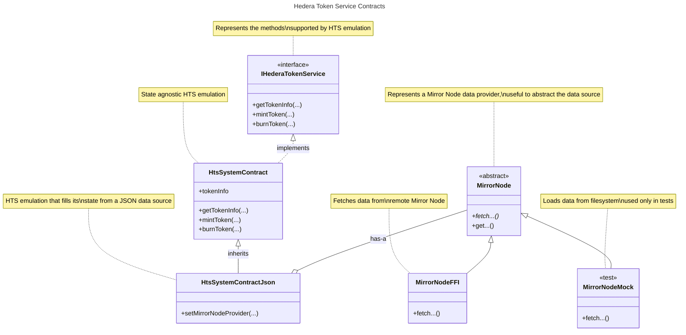
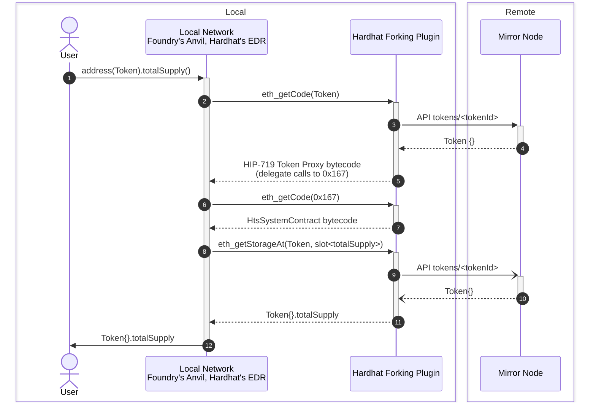

# Internals

## Background

**Fork Testing**/**Fixtures** is an Ethereum Development Environment feature that optimizes test execution for Smart Contracts.
It enables snapshotting of blockchain state, saving developement time by avoiding the recreation of the entire blockchain state for each test.
Instead, tests can revert to a pre-defined snapshot, streamlining the testing process.
Moreover, Fork Testing allows the developer to use a remote state as if was local.
Any modification will only affect the local (forked) network, relieving the user to set up private keys to interact with a remote network.

Most populars Ethereum Development Environments provide this feature, such as
[Foundry](https://book.getfoundry.sh/forge/fork-testing) and
[Hardhat](https://hardhat.org/hardhat-network/docs/overview#mainnet-forking).
This feature is enabled by their underlaying Development network, for example

- Hardhat's [EJS (EthereumJS VM)](https://github.com/nomicfoundation/ethereumjs-vm) and [EDR (Ethereum Development Runtime)](https://github.com/NomicFoundation/edr)
- Foundry's [Anvil](https://github.com/foundry-rs/foundry/tree/master/crates/anvil)
- [Ganache _(deprecated)_](https://github.com/trufflesuite/ganache)

> Please note that WaffleJS, a Smart Contracts testing library, when used it standalone, _i.e._, not inside a Hardhat project,
> [uses Ganache internally](https://github.com/TrueFiEng/Waffle/blob/238c11ccf9bcaf4b83c73eca16d25243c53f2210/waffle-provider/package.json#L47).
>
> On the other hand, Geth support some sort of snapshotting with <https://geth.ethereum.org/docs/interacting-with-geth/rpc/ns-debug#debugsethead>,
> but it is not used for development and testing of Smart Contracts.

Moreover, given that Fork testing runs on a local development network, users can use `console.log` in tests to ease the debugging process.
With `console.log`, you can print logging messages and contract variables calling `console.log` from your Solidity code.
Both [Foundry](https://book.getfoundry.sh/reference/forge-std/console-log) and [Hardhat](https://hardhat.org/tutorial/debugging-with-hardhat-network) support `console.log` (Ganache also supported `console.log`).

### How do Fixtures technically work under the hood?

Fixtures allow developers to define and reuse configurations within their test code.
These configurations detail the necessary setup steps to prepare the test environment, such as creating mock contracts or loading test data.

Fixture is a wrapper around [_Snapshot and Revert state_](https://archive.trufflesuite.com/blog/introducing-ganache-7/#4-snapshot-and-revert-state).
This is achieved by using two JSON-RPC calls,
[`evm_snapshot`](https://github.com/trufflesuite/ganache/blob/ef1858d5d6f27e4baeb75cccd57fb3dc77a45ae8/src/chains/ethereum/ethereum/RPC-METHODS.md#evm_snapshot) and
[`evm_revert`](https://github.com/trufflesuite/ganache/blob/ef1858d5d6f27e4baeb75cccd57fb3dc77a45ae8/src/chains/ethereum/ethereum/RPC-METHODS.md#evm_revert), which are provided by the underlying development network such as EDR (Hardhat), Anvil (Foundry) or Ganache (Truffle).
Developers can use `evm_snapshot` to capture a snapshot of the blockchain state at a specific block number, and `evm_revert` to revert to that snapshot later.

For example, below is [`fixture.ts`](https://github.com/TrueFiEng/Waffle/blob/238c11ccf9bcaf4b83c73eca16d25243c53f2210/waffle-provider/src/fixtures.ts) from the WaffleJS library to implement Fixtures.

```typescript
import {providers, Wallet} from 'ethers';
import {MockProvider} from './MockProvider';

export type Fixture<T> = (wallets: Wallet[], provider: MockProvider) => Promise<T>;
interface Snapshot<T> {
  fixture: Fixture<T>;
  data: T;
  id: string;
  provider: providers.Web3Provider;
  wallets: Wallet[];
}

export const loadFixture = createFixtureLoader();

export function createFixtureLoader(overrideWallets?: Wallet[], overrideProvider?: MockProvider) {
  const snapshots: Snapshot<any>[] = [];

  return async function load<T>(fixture: Fixture<T>): Promise<T> {
    const snapshot = snapshots.find((snapshot) => snapshot.fixture === fixture);
    if (snapshot) {
      await snapshot.provider.send('evm_revert', [snapshot.id]);
      snapshot.id = await snapshot.provider.send('evm_snapshot', []);
      return snapshot.data;
    } else {
      const provider = overrideProvider ?? new MockProvider();
      const wallets = overrideWallets ?? provider.getWallets();

      const data = await fixture(wallets, provider);
      const id = await provider.send('evm_snapshot', []);
      snapshots.push({fixture, data, id, provider, wallets});
      return data;
    }
  };
}
```

In the `createFixtureLoader()`, if a `snapshot` is not found, _i.e._, the fixture is created for the first time, Waffle creates a `snapshot` of the current state of the network.
However, when a `snapshot` is found, Waffle `revert`s the network to the `snapshot.id` snapshot created earlier.

Both [Foundry](https://book.getfoundry.sh/forge/writing-tests#before-test-setups) and [Hardhat](https://hardhat.org/tutorial/testing-contracts#reusing-common-test-setups-with-fixtures) support fixtures out-of-the-box.
Foundry's support is implicit given the state is reset for each test.
Moreover, both [Foundry](https://book.getfoundry.sh/reference/anvil/#special-methods) and [Hardhat](https://hardhat.org/hardhat-network/docs/reference#evm_snapshot) support calling `evm_snapshot` and `evm_revert` directly.

### Can Hedera developers use _out-of-the-box_ Fork Testing?

**Yes**, out-of-the-box Fork Testing works well when the Smart Contracts are standard EVM Smart Contracts that do not involve Hedera-specific services.
This is because fork testing is targeted at the local test network provided by the Ethereum Development Environment.
These networks are replicas of the Ethereum network and do not support any Hedera-specific service.

**No**, out-of-the-box Fork Testing will not work on Hedera for contracts that are specific to Hedera.
For example, when a contract includes a call to the `createFungibleToken` method on the HTS System Contract at `address(0x167)`.
The internal local test network provided by the Development Environment does not have any runnable contract deployed at `address(0x167)`.
This is because the local network tries to fetch the code at `address(0x167)`, for which the JSON-RPC Relay returns `0xfe`

```console
$ cast code --rpc-url https://testnet.hashio.io/api 0x0000000000000000000000000000000000000167
0xfe
```

Not being able to use Fork Testing implies also not being able to use features such as `console.log` and Fixtures during testing,
which cause frustration among Hedera users.

> [!IMPORTANT]
> This project is an attempt to fill this gap.
> It does so by providing an emulation layer for HTS written in Solidity.
> Given it is written in Solidity, it can executed in a development network environment, such as Foundry or Hardhat.

## Overview

This project has two main parts

- **[`HtsSystemContract.sol`](./src/HtsSystemContract.sol) Solidity Contract**.
  This contract provides an emulator for the Hedera Token Service written in Solidity.
  It is specially designed to work in a forked network.
  Its storage reads and writes are crafted to be reversible in a way the `hedera-forking` package can fetch the appropriate data.
- **[`@hashgraph/hedera-forking`](./index.js) CommonJS Package**.
  Provides functions that can be hooked into the Relay to fetch the appropiate data when HTS System Contract (at address `0x167`) or Hedera Tokens are invoked.
  This package uses the compilation output of the `HtsSystemContract` contract to return its bytecode and to map storage slots to field names.

The following contract diagram depics the main contracts involved and their relationships.



### How does it Work?

The following sequence diagram showcases the messages sent between components when fork testing is activated within an Ethereum Development Environment, _e.g._, Foundry or Hardhat.

> [!NOTE]
> The JSON-RPC Relay service is not shown here because is not involved when performing a requests for a Token.



The relevant interactions are

- **(5).** This is the code defined by [HIP-719](https://hips.hedera.com/hip/hip-719#specification).
  For reference, you can see the
  [`hedera-services`](https://github.com/hashgraph/hedera-services/blob/fbac99e75c27bf9c70ebc78c5de94a9109ab1851/hedera-node/hedera-smart-contract-service-impl/src/main/java/com/hedera/node/app/service/contract/impl/state/DispatchingEvmFrameState.java#L96)
  implementation.
- **(6)**-**(7)**. This calls `getHtsCode` which in turn returns the bytecode compiled from `HtsSystemContract.sol`.
- **(8)**-**(12)**. This calls `getHtsStorageAt` which uses the `HtsSystemContract`'s [Storage Layout](./INTERNALS.md#storage-layout) to fetch the appropriate state from the Mirror Node. The **(8)** JSON-RPC call is triggered as part of the `redirectForToken(address,bytes)` method call defined in HIP-719.
  Even if the call from HIP-719 is custom encoded, this method call should support standard ABI encoding as well as defined in
  [`hedera-services`](https://github.com/hashgraph/hedera-services/blob/b40f81234acceeac302ea2de14135f4c4185c37d/hedera-node/hedera-smart-contract-service-impl/src/main/java/com/hedera/node/app/service/contract/impl/exec/systemcontracts/common/AbstractCallAttempt.java#L91-L104).

## Storage Layout

The Solidity compiler `solc` provides an option to generate detailed storage layout information as part of the build output.
This feature can be enabled by selecting the `storageLayout` option,
which provides insights into how variables are stored in contract storage.

### Enabling Storage Layout

In a Foundry project, add the following line to your `foundry.toml` file

```toml
extra_output = ["storageLayout"]
```

After building your project, _e.g._. `forge build`, the `storageLayout` object is included in the output file `out/<Contract name>.sol/<Contract name>.json`.

> [!IMPORTANT]
> This is the one used in this project.

### Understanding the Storage Layout Format

The storage layout is represented in JSON format with the following fields

- **`astId`**. The identifier in the Abstract Syntax Tree (AST).
- **`contract`**. The name of the contract.
- **`label`**. The name of the instance variable.
- **`offset`**. The starting location of the variable within a `uint256` storage word.
  Multiple variables may be packed into a single memory slot when their types are smaller than a 32 bytes word.
  In such cases, the `offset` value for the second and subsequent variables will differ from `0`.
- **`slot`**. A integer representing the slot number in storage.
- **`type`**. The type of the value stored in the slot.

See <https://docs.soliditylang.org/en/latest/internals/layout_in_storage.html#json-output> for more information.

### Application to Token Smart Contract Emulation

For the purpose of our implementation,
understanding which variable names are stored in specific slots is sufficient to develop a functional emulator for the token smart contract.

### Issues with Storage for Mappings, Arrays, and Strings Longer than 31 Bytes

When dealing with mappings, arrays, and strings longer than 31 bytes in Solidity, these data types do not fit entirely within a single storage slot. This creates challenges when trying to access or compute their storage locations.

### Accessing Mappings

For mappings, the value is not stored directly in the storage slot. Instead, to access a specific value in a mapping, you must first calculate the storage slot by computing the Keccak-256 hash of the concatenation of the "key" (the mapped value) and the "slot" number where the mapping is declared.

```solidity
bytes32 storageSlot = keccak256(abi.encodePacked(key, uint256(slotNumber)));
```

To reverse-engineer or retrieve the original key (e.g., an address or token ID) from a storage slot, you'd need to maintain a mapping of keys to their corresponding storage hashes, which can be cumbersome.

### Calculating Storage for User Addresses and Token IDs

For our current use case, where we need to calculate these values for user addresses and token IDs (which are integers), this is manageable

- **User Addresses**: Since the number of user accounts is limited, their mapping can be stored and referenced as needed.
- **Token IDs**: These are sequentially incremented integers, making it possible to precompute and store their corresponding storage slots on the Hedera JSON-RPC side.

### Handling Long Strings

Handling strings longer than 31 bytes is more complex

1. **Calculate the Slot Hash.** Start by calculating the Keccak-256 hash of the slot number where the string is stored.

   ```solidity
   bytes32 hashSlot = keccak256(abi.encodePacked(uint256(slotNumber)));
   ```

2. **Retrieve the Value.** Access the value stored at this hash slot. If the string exceeds 32 bytes, retrieve the additional segments from consecutive slots (_e.g._, `hashSlot + 1`, `hashSlot + 2`, _etc._), until the entire string is reconstructed.

This process requires careful calculation and multiple reads from storage to handle longer strings properly.
