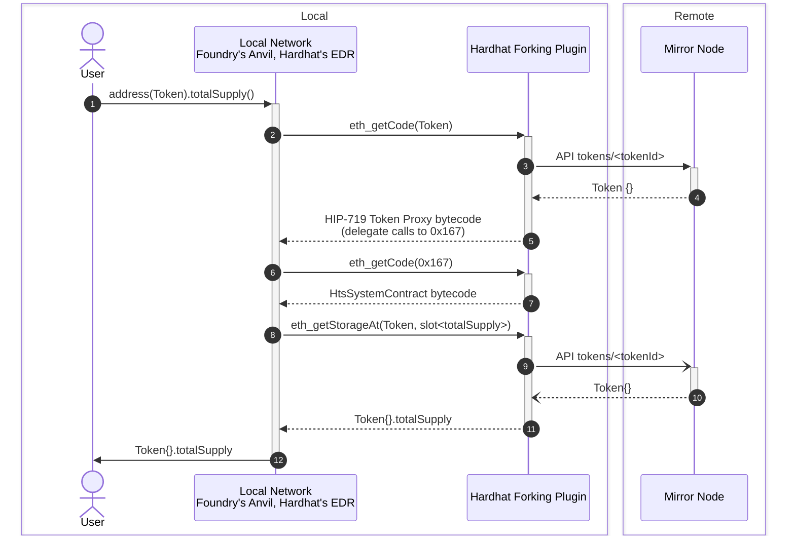

# Hedera Forking for System Contracts

**This projects allows Smart Contract developers working on Hedera to use fork testing while using Hedera System Contracts.**
It does so by providing an emulation layer for the [Hedera Token Service](https://hardhat.org/hardhat-network/docs/overview#mainnet-forking) _(more System Contracts to come)_ written in Solidity.
Given it is written in Solidity, it can be executed in a forked network environment, such as
[Foundry](https://book.getfoundry.sh/forge/fork-testing) or
[Hardhat](https://hardhat.org/hardhat-network/docs/overview#mainnet-forking).

You can use either our [Foundry library](#foundry) or [Hardhat plugin](#hardhat) to enable HTS emulation in your project.

See [Hedera Token Service Supported Methods](#hedera-token-service-supported-methods) for a list of methods currently implemented as part of this project.

## Foundry

We provide a Foundry library that enables fork testing when using HTS Tokens.

### Installation

First, install our library in your Foundry project

```console
forge install hashgraph/hedera-forking
```

### Set up

To use this library in your tests, you need to enable [`ffi`](https://book.getfoundry.sh/cheatcodes/ffi).
You can do so by adding the following lines to your `.toml` file

```toml
[profile.default]
ffi = true
```

Alternatively, you can add the `--ffi` flag to your execution script.

This is necessary because our library relies on [`curl`](https://curl.se/) to make HTTP requests to the Hedera remote network.
This enables the library to fetch token state in the remote network.
Given `curl` is an external command, `ffi` needs to be enabled.

### Usage

To enable HTS in your tests, you need to add the following setup code in your test files.
Import our wrapper function to deploy HTS emulation and enable cheat codes for it.

```solidity
import {htsSetup} from "hedera-forking/src/htsSetup.sol";
```

and then invoke it in your [test setup](https://book.getfoundry.sh/forge/writing-tests)

```solidity
    function setUp() public {
        htsSetup();
    }
```

Now you can use HTS and remote tokens as if they were deployed locally when fork testing.
For example

```solidity examples/foundry-hts/USDC.t.sol
// SPDX-License-Identifier: Apache-2.0
pragma solidity ^0.8.0;

import {Test} from "forge-std/Test.sol";
import {htsSetup} from "hedera-forking/src/htsSetup.sol";
import {IERC20} from "hedera-forking/src/IERC20.sol";

contract USDCExampleTest is Test {
    // https://hashscan.io/mainnet/token/0.0.456858
    address USDC_mainnet = 0x000000000000000000000000000000000006f89a;

    address private user1;

    function setUp() external {
        htsSetup();

        user1 = makeAddr("user1");
        deal(USDC_mainnet, user1, 1000 * 10e8);
    }

    function test_get_balance_of_existing_account() view external {
        // https://hashscan.io/mainnet/account/0.0.1528
        address usdcHolder = 0x00000000000000000000000000000000000005f8;
        // Balance retrieved from mainnet at block 72433403
        assertEq(IERC20(USDC_mainnet).balanceOf(usdcHolder), 28_525_752677);
    }

    function test_dealt_balance_of_local_account() view external {
        assertEq(IERC20(USDC_mainnet).balanceOf(user1), 1000 * 10e8);
    }
}
```

### Running your Tests

To run the tests, use the following command

```console
forge test --fork-url https://mainnet.hashio.io/api
```

You can also include a specific block number.
For example, the test above is known to work at block `72433403`

```console
forge test --fork-url https://mainnet.hashio.io/api --fork-block-number 72433403
```

## Hardhat

This plugin intercepts the calls made by Hardhat to fetch remote state, \_i.e., `eth_getCode` and `eth_getStorageAt`, to provide emulation for HTS.
It assigns the Hedera Token Service code to the `0x167` address. In your tests, you will be able to query Hedera Token data as if they were stored as regular Smart Contracts.

### Installation

To use this plugin, install it via your package manager.

If you are using **npm**

```console
npm install --save-dev @hashgraph/hardhat-forking-plugin
```

or using **yarn**

```console
yarn add --dev @hashgraph/hardhat-forking-plugin
```

### Set up

Next, add the following line to the top of your Hardhat config file, _e.g._, `hardhat.config.js`

```javascript
require('@hashgraph/hardhat-forking-plugin');
```

or if you are using TypeScript, include the following line into your `hardhat.config.ts`

```javascript
import '@hashgraph/hardhat-forking-plugin';
```

This will automatically create a worker thread to intercept calls to fetch remote state.
You can then proceed with writing your tests, and the plugin will allow you to query Hedera token data seamlessly.

### Configuration

By default, the plugin uses the Hedera Mirror Node based on the guessed chain ID from the currently forked network.

Two additional values needs to be set in order to activate the plugin.

- **`chainId`**. The call to `eth_chainId` of configuration parameter `hardhat.forking.url` needs to match the `chainId` configuration argument. Only chain IDs `295` (Mainnet), `296` (Testnet), and `297` (Previewnet) are supported.
- **`workerPort`**. Any free port to start the worker to intercept Hardhat calls to fetch remote state.

For example

```javascript
    networks: {
        hardhat: {
            forking: {
                url: 'https://mainnet.hashio.io/api',
                // This allows Hardhat to enable JSON-RPC's response cache.
                // Forking from a block is not fully integrated yet into HTS emulation.
                blockNumber: 70531900,
                chainId: 295,
                workerPort: 1235,
            },
        },
    },
```

> [!NOTE]
> Unfortunately, these configuration settings cannot be set automatically by the Plugin.
> This is because the way Hardhat plugins are loaded by Hardhat.
> The main issue is _"since Hardhat needs to be loadable via `require` call, configuration must be synchronous"_.
> See [here](https://github.com/NomicFoundation/hardhat/issues/3287) and [here](https://github.com/NomicFoundation/hardhat/issues/2496) for more details.
>
> We need to shift the setting of `chainId` and `workerPort` to the user,
> Creating a Worker so we can hook into `eth_getCode` and `eth_getStorageAt` to provide HTS emulation and querying the `chainId` of a remote network are **asynchronous** operations.

### Running Your Tests

For example, to query USDC information on mainnet you can use the following test

```javascript examples/hardhat-hts/test/usdc-info.test.js
const { expect } = require('chai');
const { ethers: { getContractAt } } = require('hardhat');

describe('USDC example -- informational', function () {
    it('should get name, symbol and decimals', async function () {
        // https://hashscan.io/mainnet/token/0.0.456858
        const usdc = await getContractAt('IERC20', '0x000000000000000000000000000000000006f89a');
        expect(await usdc['name']()).to.be.equal('USD Coin');
        expect(await usdc['symbol']()).to.be.equal('USDC');
        expect(await usdc['decimals']()).to.be.equal(6n);
    });
});
```

Then run your Hardhat tests as usual

```console
npx hardhat
```

You can also query an existing account's balance.
For example using the `blockNumber` as shown above in [_Configuration_](#configuration),
you can query the USDC balance for an existing account.

```javascript examples/hardhat-hts/test/usdc-balance.test.js
const { expect } = require('chai');
const { ethers: { getContractAt } } = require('hardhat');

describe('USDC example -- balanceOf', function () {
    it('should get `balanceOf` account holder', async function () {
        // https://hashscan.io/mainnet/token/0.0.456858
        const usdc = await getContractAt('IERC20', '0x000000000000000000000000000000000006f89a');

        // https://hashscan.io/mainnet/account/0.0.6279
        const holderAddress = '0x0000000000000000000000000000000000001887';
        expect(await usdc['balanceOf'](holderAddress)).to.be.equal(31_166_366226);
    });
});
```

You can also perform modifications in the forked network.
Let's see an example where we execute the `transfer` method from an existing account to a local Hardhat signer.
It is usually paired with [Fixtures](https://hardhat.org/hardhat-network-helpers/docs/reference#fixtures),
so that each test can start in a known state.
Moreover, you can use the tools you are already familiar with, for example,
[`hardhat_impersonateAccount`](https://hardhat.org/hardhat-network/docs/reference#hardhat_impersonateaccount).

```javascript examples/hardhat-hts/test/usdc-transfer.test.js
const { expect } = require('chai');
const { ethers: { getSigner, getSigners, getContractAt }, network: { provider } } = require('hardhat');
const { loadFixture } = require('@nomicfoundation/hardhat-toolbox/network-helpers');

describe('USDC example -- transfer', function () {
    async function id() {
        return [(await getSigners())[0]];
    }

    it("should `tranfer` tokens from account holder to one of Hardhat' signers", async function () {
        const [receiver] = await loadFixture(id);

        // https://hashscan.io/mainnet/account/0.0.6279
        const holderAddress = '0x0000000000000000000000000000000000001887';
        await provider.request({
            method: 'hardhat_impersonateAccount',
            params: [holderAddress],
        });
        const holder = await getSigner(holderAddress);

        // https://hashscan.io/mainnet/token/0.0.456858
        const usdc = await getContractAt('IERC20', '0x000000000000000000000000000000000006f89a');

        expect(await usdc['balanceOf'](receiver.address)).to.be.equal(0n);

        await usdc.connect(holder)['transfer'](receiver, 10_000_000n);

        expect(await usdc['balanceOf'](receiver.address)).to.be.equal(10_000_000n);
    });
});
```

### Endpoints with Altered Behavior

The first RPC call using the Hardhat provider will set up the HTS bytecode via the JSON RPC method `hardhat_setCode`.

This operation will only work if the precompile address is not already occupied by an existing smart contract on your network. Forks of networks with no code deployed to the `0x167` address are required for this functionality.

Each time the `eth_call` method is invoked, the target address will be checked to see if it represents a token by querying the MirrorNode. Its basic storage fields (such as name, balance, decimals, etc.) will be set using the `hardhat_setStorageAt` method.

If the function selector in the `eth_call` request corresponds to any of the following functions, an additional operation will be performed, as described below:

Additionally, by loading the HTS and token code into the EVM, the following methods can be called on the token's address, functioning similarly to how they would on the actual Hedera EVM:

## Hedera Token Service Supported Methods

Given your HTS token address, you can invoke these functions whether the token is either fungible or non-fungible.

### Fungible Tokens

The following methods are applicable to Fungible Tokens.

#### ERC20 Interface

<!-- !./scripts/abi-table.js out/IERC20.sol/IERC20.json out/IERC20.sol/IERC20Events.json -->

| Function                                                          | Comment                                                                                                                                                                                                              |
| ----------------------------------------------------------------- | -------------------------------------------------------------------------------------------------------------------------------------------------------------------------------------------------------------------- |
| `allowance(address owner, address spender) view`                  | Returns the remaining number of tokens that `spender` will be allowed to spend on behalf of `owner` through {transferFrom}. This is zero by default. This value changes when {approve} or {transferFrom} are called. |
| `approve(address spender, uint256 amount)`                        | Sets a `value` amount of tokens as the allowance of `spender` over the caller's tokens. Returns a boolean value indicating whether the operation succeeded.                                                          |
| `balanceOf(address account) view`                                 | Returns the value of tokens owned by `account`.                                                                                                                                                                      |
| `decimals() view`                                                 | Returns the decimals places of the token.                                                                                                                                                                            |
| `name() view`                                                     | Returns the name of the token.                                                                                                                                                                                       |
| `symbol() view`                                                   | Returns the symbol of the token.                                                                                                                                                                                     |
| `totalSupply() view`                                              | Returns the value of tokens in existence.                                                                                                                                                                            |
| `transfer(address recipient, uint256 amount)`                     | Moves a `value` amount of tokens from the caller's account to `to`. Returns a boolean value indicating whether the operation succeeded.                                                                              |
| `transferFrom(address sender, address recipient, uint256 amount)` | Moves a `value` amount of tokens from `from` to `to` using the allowance mechanism. `value` is then deducted from the caller's allowance. Returns a boolean value indicating whether the operation succeeded.        |

| Event                                                                      | Comment                                                                                                               |
| -------------------------------------------------------------------------- | --------------------------------------------------------------------------------------------------------------------- |
| `Approval(address indexed owner, address indexed spender, uint256 amount)` | Emitted when the allowance of a `spender` for an `owner` is set by a call to {approve}. `value` is the new allowance. |
| `Transfer(address indexed from, address indexed to, uint256 amount)`       | Emitted when `value` tokens are moved from one account (`from`) to another (`to`). Note that `value` may be zero.     |

<!-- -->

#### Association Methods Interface

<!-- !./scripts/abi-table.js out/IHRC719.sol/IHRC719.json -->

| Function              | Comment                                                                                                                        |
| --------------------- | ------------------------------------------------------------------------------------------------------------------------------ |
| `associate()`         | Associates the calling account with the token This function allows an account to opt-in to receive the token                   |
| `dissociate()`        | Dissociates the calling account from the token This function allows an account to opt-out from receiving the token             |
| `isAssociated() view` | Checks if the calling account is associated with the token This function returns the association status of the calling account |

<!-- -->

### Non-Fungible Tokens

The following methods are applicable to Non-Fungible Tokens.

> [!NOTE]
> ERC721 support coming soon!

#### Association Methods Interface

<!-- !./scripts/abi-table.js out/IHRC719.sol/IHRC719.json -->

| Function              | Comment                                                                                                                        |
| --------------------- | ------------------------------------------------------------------------------------------------------------------------------ |
| `associate()`         | Associates the calling account with the token This function allows an account to opt-in to receive the token                   |
| `dissociate()`        | Dissociates the calling account from the token This function allows an account to opt-out from receiving the token             |
| `isAssociated() view` | Checks if the calling account is associated with the token This function returns the association status of the calling account |

<!-- -->

### Hedera Token Service (located at address `0x167`)

The following methods can be invoked on the Hedera Token Service contract located at address `0x167`.

<!-- !./scripts/abi-table.js out/IHederaTokenService.sol/IHederaTokenService.json -->

| Function                                                        | Comment                                                        |
| --------------------------------------------------------------- | -------------------------------------------------------------- |
| `burnToken(address token, int64 amount, int64[] serialNumbers)` | Burns an amount of the token from the defined treasury account |
| `getTokenInfo(address token)`                                   | Query token info                                               |
| `mintToken(address token, int64 amount, bytes[] metadata)`      | Mints an amount of the token to the defined treasury account   |

<!-- -->

## Background

**Fork Testing** (or **WaffleJS Fixtures**) is an Ethereum Development Environment feature that optimizes test execution for Smart Contracts.
It enables snapshotting of blockchain state, saving developement time by avoiding the recreation of the entire blockchain state for each test.
Instead, tests can revert to a pre-defined snapshot, streamlining the testing process.
Most populars Ethereum Development Environments provide this feature, such as
[Foundry](https://book.getfoundry.sh/forge/fork-testing) and
[Hardhat](https://hardhat.org/hardhat-network/docs/overview#mainnet-forking).

This feature is enabled by their underlaying Development network, for example

- Hardhat's [EJS (EthereumJS VM)](https://github.com/nomicfoundation/ethereumjs-vm) and [EDR (Ethereum Development Runtime)](https://github.com/NomicFoundation/edr)
- Foundry's [Anvil](https://github.com/foundry-rs/foundry/tree/master/crates/anvil)
- [Ganache _(deprecated)_](https://github.com/trufflesuite/ganache)

Please note that WaffleJS, when used directly as a library, _i.e._, not inside a Hardhat project,
[uses Ganache internally](https://github.com/TrueFiEng/Waffle/blob/238c11ccf9bcaf4b83c73eca16d25243c53f2210/waffle-provider/package.json#L47).

On the other hand, Geth support some sort of snapshotting with <https://geth.ethereum.org/docs/interacting-with-geth/rpc/ns-debug#debugsethead>,
but it’s not commonly used for development and testing of Smart Contracts.

Moreover, given that Fork testing runs on a local development network, users can use `console.log` in tests to ease the debugging process.
With `console.log`, you can print logging messages and contract variables calling `console.log` from your Solidity code.
Both [Foundry](https://book.getfoundry.sh/reference/forge-std/console-log) and [Hardhat](https://hardhat.org/tutorial/debugging-with-hardhat-network) support `console.log`.
Not being able to use Forking (see below) implies also not being able to use `console.log` in tests,
which cause frustration among Hedera users.

### Can Hedera developers use Fork Testing?

**Yes**, Fork Testing works well when the Smart Contracts are standard EVM Smart Contracts that do not involve Hedera-specific services.
This is because fork testing is targeted at the local test network provided by the Ethereum Development Environment.
These networks are somewhat replicas of the Ethereum network and do not support Hedera-specific services.

**No**, Fork Testing will not work on Hedera for contracts that are specific to Hedera.
For example, if a contract includes calls to the `createFungibleToken` method on the HTS System Contract at `address(0x167)`.
This is because the internal local test network provided by the framework (`chainId: 1337`) does not have the precompiled HTS contract deployed at `address(0x167)`.

This project is an attempt to solve this problem.
It does so by providing an emulation layer for HTS written in Solidity.
Given it is written in Solidity, it can executed in a development network environment, such as Foundry or Hardhat.

## Overview

This project has two main parts

- **[`HtsSystemContract.sol`](./src/HtsSystemContract.sol) Solidity Contract**.
  This contract provides an emulator for the Hedera Token Service written in Solidity.
  It is specially designed to work in a forked network.
  Its storage reads and writes are crafted to be reversible in a way the `hedera-forking` package can fetch the appropriate data.
- **[`@hashgraph/hedera-forking`](./index.js) CommonJS Package**.
  Provides functions that can be hooked into the Relay to fetch the appropiate data when HTS System Contract (at address `0x167`) or Hedera Tokens are invoked.
  This package uses the compilation output of the `HtsSystemContract` contract to return its bytecode and to map storage slots to field names.

### How does it Work?

The following sequence diagram showcases the messages sent between components when fork testing is activated within an Ethereum Development Environment, _e.g._, Foundry or Hardhat.

> [!NOTE]
> The JSON-RPC Relay service is not shown here because is not involved when performing a requests for a Token.



The relevant interactions are

- **(5).** This is the code defined by [HIP-719](https://hips.hedera.com/hip/hip-719#specification).
  For reference, you can see the
  [`hedera-services`](https://github.com/hashgraph/hedera-services/blob/fbac99e75c27bf9c70ebc78c5de94a9109ab1851/hedera-node/hedera-smart-contract-service-impl/src/main/java/com/hedera/node/app/service/contract/impl/state/DispatchingEvmFrameState.java#L96)
  implementation.
- **(6)**-**(7)**. This calls `getHtsCode` which in turn returns the bytecode compiled from `HtsSystemContract.sol`.
- **(8)**-**(12)**. This calls `getHtsStorageAt` which uses the `HtsSystemContract`'s [Storage Layout](./INTERNALS.md#storage-layout) to fetch the appropriate state from the Mirror Node. The **(8)** JSON-RPC call is triggered as part of the `redirectForToken(address,bytes)` method call defined in HIP-719.
  Even if the call from HIP-719 is custom encoded, this method call should support standard ABI encoding as well as defined in
  [`hedera-services`](https://github.com/hashgraph/hedera-services/blob/b40f81234acceeac302ea2de14135f4c4185c37d/hedera-node/hedera-smart-contract-service-impl/src/main/java/com/hedera/node/app/service/contract/impl/exec/systemcontracts/common/AbstractCallAttempt.java#L91-L104).

## Build

This repo consists of two projects/packages.
A Foundry project, to compile and test the `HtsSystemContract.sol` contract.
And an `npm` package that implements both `eth_getCode` and `eth_getStorageAt` JSON-RPC methods when HTS emulation is involved together with the Hardhat plugin that uses these methods.

To compile the `HtsSystemContract`, its dependencies and the test contracts run

```console
forge build
```

There is no compilation step to build the `@hashgraph/hedera-forking` package.
However, you can type-check it by running

```console
npm run type-check
```

## Tests

> [!TIP]
> The [`create-token.js`](./scripts/create-token.js) script was used to deploy Tokens using HTS to `testnet` for testing purposes.

### `getHtsCode`, `getHtsStorageAt` and `getHIP719Code` Unit Tests

These tests only involve testing `getHtsCode`, `getHtsStorageAt` and `getHIP719Code` functions.
In other words, they do not use the `HtsSystemContract` bytecode, only its `storageLayout` definition. To run them, execute

```console
npm run test
```

### `HtsSystemContract` Solidity tests + local storage emulation (_without_ forking)

We use Foundry cheatcodes, _i.e._,
[`vm.store`](https://book.getfoundry.sh/cheatcodes/store) and
[`vm.load`](https://book.getfoundry.sh/cheatcodes/load),
to provide local storage emulation that allow us to run `HtsSystemContract` Solidity tests without starting out a separate JSON-RPC process.

```console
forge test
```

> [!TIP]
> You can use the `--match-contract` flag to filter the tests to be executed if needed.
> In addition, usually when debugging the contract under test we are interested in getting the Solidity traces.
> We can use the `forge` flag `-vvvv` to display them.
> For example
>
> ```console
> forge test --match-contract TokenTest -vvvv
> ```

When running these tests **without** forking from a remote network,
the package `@hashgraph/hedera-forking` is not under test.

### `HtsSystemContract` Solidity tests + Mirror Node FFI (with mocked `curl`)

```console
PATH=./scripts:$PATH forge test --fork-url https://testnet.hashio.io/api --fork-block-number 8535327
```

In case needed, there is a trace log of requests made by mocked `curl` in `scripts/curl.log`

```console
cat scripts/curl.log
```

### `HtsSystemContract` Solidity tests + JSON-RPC mock server for storage emulation (_with_ forking)

These Solidity tests are used to test both the `HtsSystemContract` and the `@hashgraph/hedera-forking` package.
Instead of starting a `local-node` or using a remote network,
they use the [`json-rpc-mock.js`](./scripts/json-rpc-mock.js) script as a backend without the need for any additional service.
This is the network Foundry's Anvil is forking from.

In a separate terminal run the JSON-RPC Mock Server

```console
./scripts/json-rpc-mock.js
```

Then run

```console
forge test --fork-url http://localhost:7546 --no-storage-caching
```

> [!IMPORTANT]
> The `--no-storage-caching` flag disables the JSON-RPC calls cache,
> which is important to make sure the `json-rpc-mock.js` is reached in each JSON-RPC call.
> See <https://book.getfoundry.sh/reference/forge/forge-test#description> for more information.

### `HtsSystemContract` Solidity tests + Relay for storage emulation (with forking)

These tests are the same of the section above, but instead of using the `json-rpc-mock.js` it uses the Relay with `hedera-forking` enabled pointing to `testnet`.

## Internals

For detailed information on how this project works, see [Internals](./INTERNALS.md).

## Support

If you have a question on how to use the product, please see our
[support guide](https://github.com/hashgraph/.github/blob/main/SUPPORT.md).

## Contributing

Contributions are welcome. Please see the
[contributing guide](https://github.com/hashgraph/.github/blob/main/CONTRIBUTING.md)
to see how you can get involved.

## Code of Conduct

This project is governed by the
[Contributor Covenant Code of Conduct](https://github.com/hashgraph/.github/blob/main/CODE_OF_CONDUCT.md). By
participating, you are expected to uphold this code of conduct. Please report unacceptable behavior
to [oss@hedera.com](mailto:oss@hedera.com).

## License

[Apache License 2.0](LICENSE)

## Security

Please do not file a public ticket mentioning the vulnerability.
Refer to the security policy defined in the [SECURITY.md](SECURITY.md).
