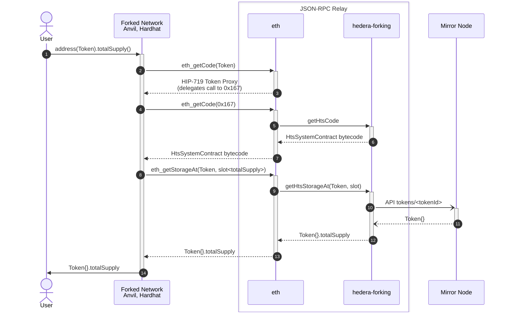

# Hedera Fork Testing Support

## Background

**Fork Testing** (or **WaffleJS Fixtures**) is an Ethereum Development Environment feature that optimizes test execution for Smart Contracts.
It enables snapshotting of blockchain state, saving developement time by avoiding the recreation of the entire blockchain state for each test.
Instead, tests can revert to a pre-defined snapshot, streamlining the testing process.
Most populars Ethereum Development Environments provide this feature, such as
[Foundry](https://book.getfoundry.sh/forge/fork-testing) and
[Hardhat](https://hardhat.org/hardhat-network/docs/overview#mainnet-forking).

This feature is enabled by their underlaying Development network, for example

- Hardhat's [EJS (EthereumJS VM)](https://github.com/nomicfoundation/ethereumjs-vm) and [EDR (Ethereum Development Runtime)](https://github.com/NomicFoundation/edr)
- Foundry's [Anvil](https://github.com/foundry-rs/foundry/tree/master/crates/anvil)
- [Ganache _(deprecated)_](https://github.com/trufflesuite/ganache)

Please note that WaffleJS, when used directly as a library, _i.e._, not inside a Hardhat project,
[uses Ganache internally](https://github.com/TrueFiEng/Waffle/blob/238c11ccf9bcaf4b83c73eca16d25243c53f2210/waffle-provider/package.json#L47).

On the other hand, Geth support some sort of snapshotting with <https://geth.ethereum.org/docs/interacting-with-geth/rpc/ns-debug#debugsethead>,
but it’s not commonly used for development and testing of Smart Contracts.

Moreover, given that Fork testing runs on a local development network, users can use `console.log` in tests to ease the debugging process.
With `console.log`, you can print logging messages and contract variables calling `console.log` from your Solidity code.
Both [Foundry](https://book.getfoundry.sh/reference/forge-std/console-log) and [Hardhat](https://hardhat.org/tutorial/debugging-with-hardhat-network) support `console.log`.
Not being able to use Forking (see below) implies also not being able to use `console.log` in tests,
which cause frustration among Hedera users.

### Can Hedera developers use Fork Testing?

**Yes**, Fork Testing works well when the Smart Contracts are standard EVM Smart Contracts that do not involve Hedera-specific services.
This is because fork testing is targeted at the local test network provided by the Ethereum Development Environment.
These networks are somewhat replicas of the Ethereum network and do not support Hedera-specific services.

**No**, Fork Testing will not work on Hedera for contracts that are specific to Hedera.
For example, if a contract includes calls to the `createFungibleToken` method on the HTS System Contract at `address(0x167)`.
This is because the internal local test network provided by the framework (`chainId: 1337`) does not have the precompiled HTS contract deployed at `address(0x167)`.

This project is an attempt to solve this problem.
It does so by providing an emulation layer for HTS written in Solidity.
Given it is written in Solidity, it can executed in a development network environment, such as Foundry or Hardhat.

## Overview

This project has two main parts

- **[`HtsSystemContract.sol`](./src/HtsSystemContract.sol) Solidity Contract**.
This contract provides an emulator for the Hedera Token Service written in Solidity.
It is specially designed to work in a forked network.
Its storage reads and writes are crafted to be reversible in a way the `hedera-forking` package can fetch the appropriate data.
- **[`@hashgraph/hedera-forking`](./index.js) CommonJS Package**.
Provides functions that can be hooked into the Relay to fetch the appropiate data when HTS System Contract (at address `0x167`) or Hedera Tokens are invoked.
This package uses the compilation output of the `HtsSystemContract` contract to return its bytecode and to map storage slots to field names.

> [!IMPORTANT]
> The compilation output of `HtsSystemContract` is version controlled.
> The benefit of including a generated file is that it allows the Relay to consume the JS package directly [from GitHub](https://docs.npmjs.com/cli/v10/configuring-npm/package-json#git-urls-as-dependencies).
> This is also the reason we use [_JSDoc_](https://www.typescriptlang.org/docs/handbook/jsdoc-supported-types.html) instead of TypeScript, to avoid the compilation step.
> This, in turn, avoids publishing an `npm` package.

## Build

To compile the `HtsSystemContract` and test contracts

```console
forge build
```

> [!TIP]
> Keep in mind the compilation output of `HtsSystemContract` is versioned.
> So it will appear as modified after `forge build` when `HtsSystemContract` has been changed.

There is no compilation step to build the `@hashgraph/hedera-forking` package.
However, you can type-checked it running

```console
npm run typecheck
```

### Test

Given we are interested in analyze Solidity traces, we can use the `forge` flag `-vvvv` to display them.
It is useful to filter to a specific test file, for example

```console
forge test --match-contract USDCTest -vvvv
```

## Diagram



## Use Cases

create token using launch-token

## Token bytecode

<https://hips.hedera.com/hip/hip-719#specification>

https://github.com/hashgraph/hedera-services/blob/fbac99e75c27bf9c70ebc78c5de94a9109ab1851/hedera-node/hedera-smart-contract-service-impl/src/main/java/com/hedera/node/app/service/contract/impl/state/DispatchingEvmFrameState.java#L96

Another alternative could be something like

https://book.getfoundry.sh/cheatcodes/etch
https://book.getfoundry.sh/reference/forge-std/deployCodeTo

The `launch-token` is used to deploy new Tokens using HTS to `testnet`.

<https://github.com/hashgraph/hedera-services/blob/b40f81234acceeac302ea2de14135f4c4185c37d/hedera-node/hedera-smart-contract-service-impl/src/main/java/com/hedera/node/app/service/contract/impl/exec/systemcontracts/common/AbstractCallAttempt.java#L91-L104>

## Storage Layout Analysis

The Solidity compiler `solc` provides an option to generate detailed storage layout information as part of the build output. This feature can be enabled by selecting the `storageLayout` option, which provides insights into how variables are stored in contract storage.

### Enabling Storage Layout in Hardhat

To generate the storage layout using Hardhat, you need to modify the Hardhat configuration file (`hardhat.config.js`) as follows:

```javascript
module.exports = {
  solidity: {
    settings: {
      outputSelection: {
        "*": {
          "*": ["storageLayout"]
        }
      }
    }
  }
};
```

With this configuration, the storage layout information will be included in the build artifacts. You can find this information in the following path within the build output:

```txt
output -> contracts -> ContractName.sol -> ContractName -> storageLayout
```

### Enabling Storage Layout in Foundry

add the following line to your `foundry.toml` file:

```toml
extra_output = ["storageLayout"]
```

### Understanding the Storage Layout Format

The storage layout is represented in JSON format with the following fields:

- **`ast_id`**: The identifier in the Abstract Syntax Tree (AST).
- **`contract`**: The name of the contract.
- **`label`**: The name of the variable.
- **`offset`**: The starting location of the variable in memory. For smaller values, multiple variables may be packed into a single memory slot. In such cases, the `offset` value for the second and subsequent variables will differ from 0.
- **`slot`**: An integer representing the slot number in storage.
- **`type`**: The type of the value stored in the slot.

### Application to Token Smart Contract Emulation

For the purpose of our implementation, understanding which variable names are stored in specific slots is sufficient to develop a functional emulator for the token smart contract.

### Issues with Storage for Mappings, Arrays, and Strings Longer than 31 Bytes

When dealing with mappings, arrays, and strings longer than 31 bytes in Solidity, these data types do not fit entirely within a single storage slot. This creates challenges when trying to access or compute their storage locations.

### Accessing Mappings

For mappings, the value is not stored directly in the storage slot. Instead, to access a specific value in a mapping, you must first calculate the storage slot by computing the Keccak-256 hash of the concatenation of the "key" (the mapped value) and the "slot" number where the mapping is declared.

```solidity
bytes32 storageSlot = keccak256(abi.encodePacked(key, uint256(slotNumber)));
```

To reverse-engineer or retrieve the original key (e.g., an address or token ID) from a storage slot, you'd need to maintain a mapping of keys to their corresponding storage hashes, which can be cumbersome.

### Calculating Storage for User Addresses and Token IDs

For our current use case, where we need to calculate these values for user addresses and token IDs (which are integers), this is manageable

- **User Addresses**: Since the number of user accounts is limited, their mapping can be stored and referenced as needed.
- **Token IDs**: These are sequentially incremented integers, making it possible to precompute and store their corresponding storage slots on the Hedera JSON-RPC side.

### Handling Long Strings

Handling strings longer than 31 bytes is more complex

1. **Calculate the Slot Hash.** Start by calculating the Keccak-256 hash of the slot number where the string is stored.

    ```solidity
    bytes32 hashSlot = keccak256(abi.encodePacked(uint256(slotNumber)));
    ```

2. **Retrieve the Value.** Access the value stored at this hash slot. If the string exceeds 32 bytes, retrieve the additional segments from consecutive slots (_e.g._, `hashSlot + 1`, `hashSlot + 2`, _etc._), until the entire string is reconstructed.

This process requires careful calculation and multiple reads from storage to handle longer strings properly.
